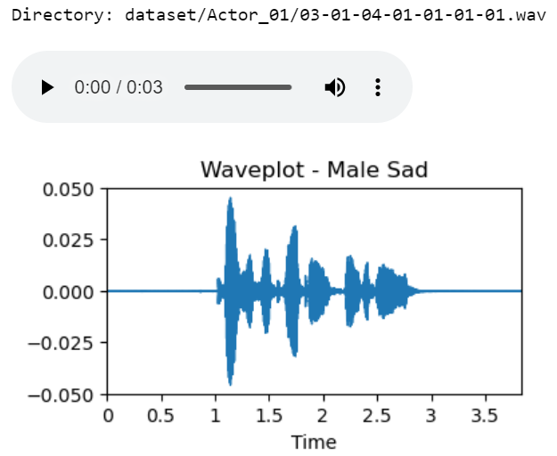
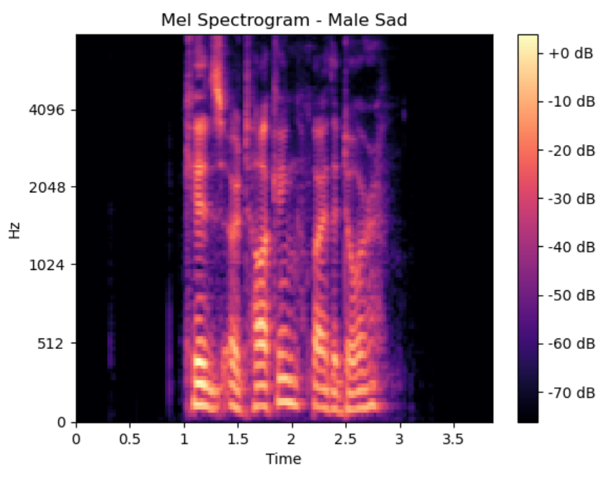
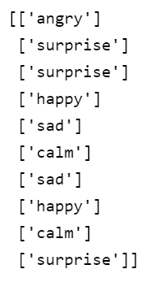
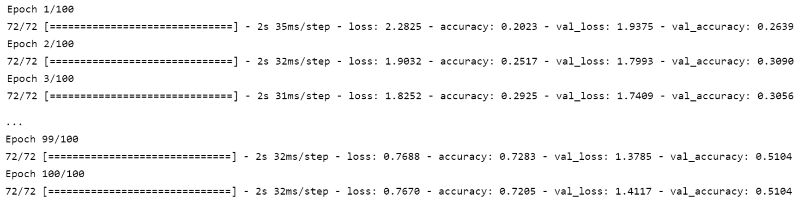
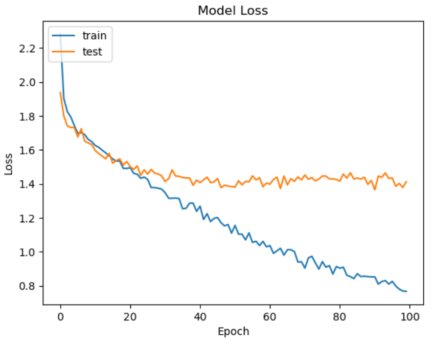
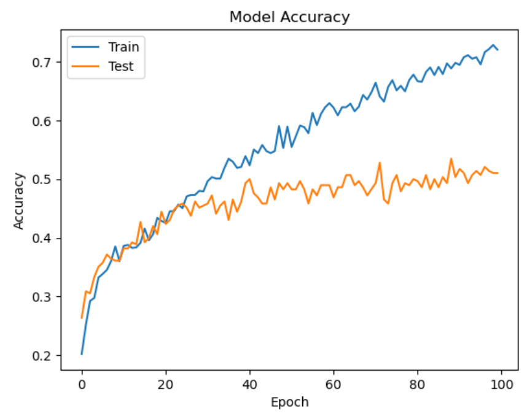
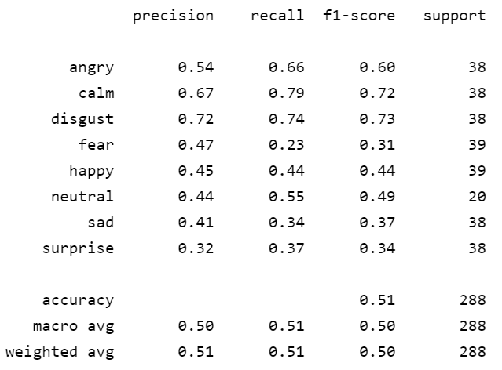
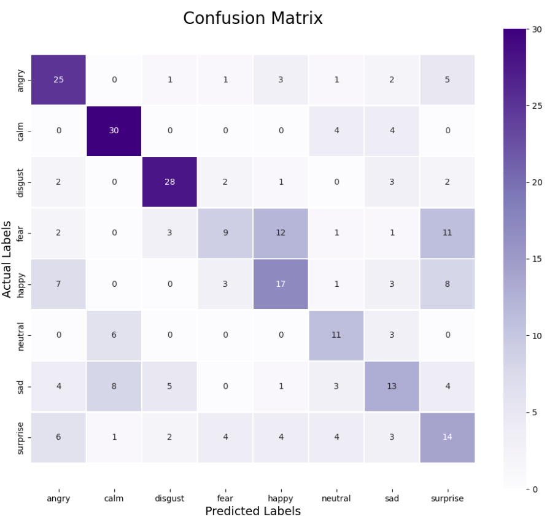

# Speech-Emotion-Recognition

Using a Convolutional Neural Network to train the RAVDESS dataset for speech emotion recognition.

 

## Background
The experiment uses the librosa library to parse the audio. Librosa is a Python library for analyzing audio and music, with a flatter layout, standardized interfaces and names, backward compatibility, modular functions, and readable code. The experiment aims to build a model to recognize emotion in speech using librosa and sklearn libraries and the RAVDESS dataset. The RAVDESS (Ryerson Audio-Visual Database of Emotional Speech and Song) dataset is an audio-visual database of emotional speech, which contains 1440 files, and 24 people (12 males, 12 females) conducted 10 tests on emotional validity, intensity and authenticity. ratings. The entire dataset is 24.8GB from 24 actors and can be downloaded from the link below in ***Dataset***. Actors spoke two lexically matched statements using a neutral North American accent, and verbal emotions included expressions of calm, happiness, sadness, anger, fear, surprise, and disgust. Each expression is classified into three emotional intensities, normal, strong and neutral.

 

## Dataset
Speech Emotion Recognition RAVDESS Dataset

Link: https://www.kaggle.com/datasets/uwrfkaggler/ravdess-emotional-speech-audio

 

## Audio and Waveplot Display

|                         Female Angry                         |                           Male Sad                           |
| :----------------------------------------------------------: | :----------------------------------------------------------: |
|  |  |

 

## Mel Spectrogram

|                         Female Angry                         |                           Male Sad                           |
| :----------------------------------------------------------: | :----------------------------------------------------------: |
|  |  |

 

## One-Hot Encoder

| Label                                                        | One-Hot Encoder                                              |
| :------------------------------------------------------------: | :------------------------------------------------------------: |
|  |  |

 

## Result

|  |
| ------------------------------------------------------------ |

 

|  |  |
| ------------------------------------------------------------ | ------------------------------------------------------------ |

 

|  |
| ------------------------------------------------------------ |

 

|  |
| ------------------------------------------------------------ |

