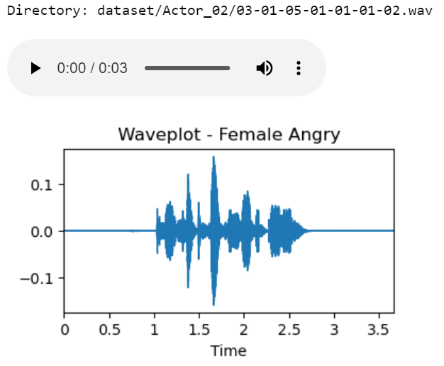
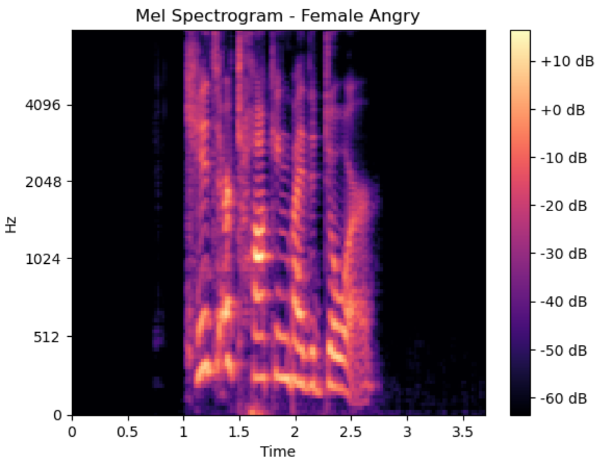
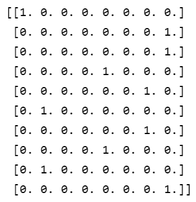

# Speech-Emotion-Recognition

 

## Audio and Waveplot Display

|                         Female Angry                         |                           Male Sad                           |
| :----------------------------------------------------------: | :----------------------------------------------------------: |
|  |  |

 

## Mel Spectrogram

|                         Female Angry                         |                           Male Sad                           |
| :----------------------------------------------------------: | :----------------------------------------------------------: |
|  |  |

 

## One-Hot Encoder

| Label                                                        | One-Hot Encoder                                              |
| :------------------------------------------------------------: | :------------------------------------------------------------: |
|  |  |

 

## Result

|  |
| ------------------------------------------------------------ |

 

|  |  |
| ------------------------------------------------------------ | ------------------------------------------------------------ |

 

|  |
| ------------------------------------------------------------ |

 

|  |
| ------------------------------------------------------------ |

